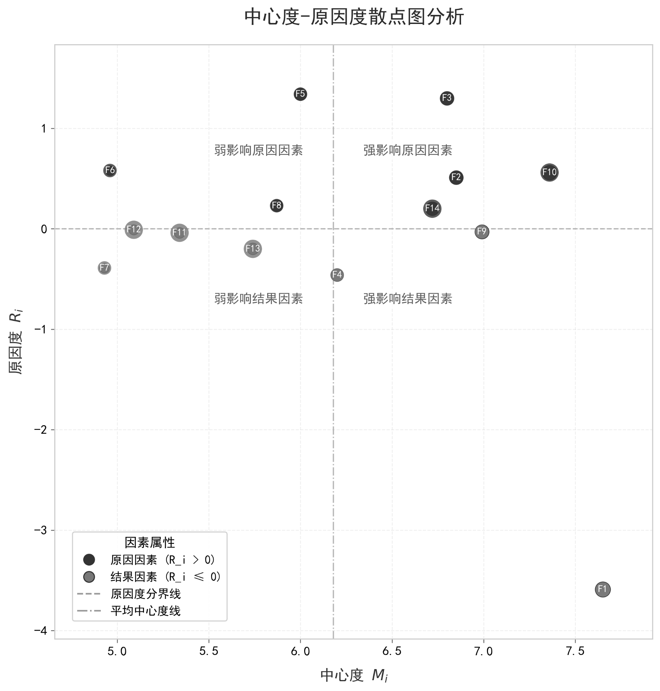

# Analysis of Factors Affecting Re-employment of Elderly Workers Based on Text Mining

This repository presents an academic reconstruction of a Labor Economics course project completed at Southwestern University of Finance and Economics in the 2024–2025 Spring semester. The study investigates the main factors affecting the re-employment of elderly workers in China under the broader context of population ageing and delayed retirement reform.

## Abstract

This project identifies and analyzes the key factors influencing the re-employment of elderly workers through a text-mining and structural-analysis framework. Using policy documents together with public opinion texts collected from social media platforms, the study first applies Latent Dirichlet Allocation (LDA) to extract latent themes related to elderly labor re-employment. It then integrates DEMATEL and ISM to examine inter-factor influence intensity, causal structure, and hierarchical relationships. The final results indicate that the issue is shaped by four dimensions—individual, technological, social, and policy-institutional—with ten specific factors. Among them, skill adaptability functions as the most direct surface-level factor, while workplace age discrimination and group norm effects act as deeper structural constraints.

## Research Background

As population ageing intensifies in China, delayed retirement has gradually become an important policy issue. At the same time, whether elderly workers are willing and able to re-enter the labor market depends not only on health or income, but also on social norms, technological change, and institutional support. This project therefore focuses on one central question:

**What are the core factors affecting the re-employment of elderly workers, and how are these factors structurally related to one another?**

## Data Sources

The corpus was constructed from both official and public-discourse texts:

- policy-related documents on delayed retirement and elderly labor employment
- Weibo comments on related topics
- Bilibili danmaku texts and public discussion content

According to the course paper, the data were collected between **2024-09-10 and 2025-06-01**, yielding a corpus of **155,865 Chinese characters** after aggregation. Text preprocessing included segmentation with `jieba`, stopword removal, duplicate removal, and corpus consolidation.

## Methodological Framework

The project adopts an **LDA–DEMATEL–ISM** integrated framework.

### 1. Topic extraction with LDA

LDA was used to identify latent themes from the combined corpus. Topic-number selection was based on perplexity comparison, and the final model retained **10 topics**.

### 2. Semantic influence matrix construction

To avoid the subjectivity of expert scoring, the project constructed an influence matrix from text data using:

- TF-IDF for keyword weighting
- Word2Vec for semantic representation
- cosine similarity for inter-factor association measurement
- a Top-3 averaging strategy and nonlinear transformation to strengthen interpretability

### 3. Structural relationship analysis

The semantic association matrix was then introduced into a DEMATEL-style analysis to compute:

- influence degree
- affected degree
- centrality
- causality

Finally, ISM was applied to derive the hierarchical structure of factors. The course paper reports that a threshold of **0.72** produced the most suitable reachability matrix.

## Factor System

The final factor system contains four dimensions and ten factors:

### Individual dimension
- Health and physical condition
- Re-employment willingness
- Skill adaptability

### Technological dimension
- Digital access capability
- Technology substitution risk

### Social dimension
- Workplace age discrimination
- Family responsibility conflict
- Group norm effect

### Policy-institutional dimension
- Policy support intensity
- Institutional completeness

## Main Findings

The original paper and presentation support the following conclusions:

1. **Skill adaptability** is the most important direct factor in the whole system and occupies the surface layer of the hierarchical structure.
2. **Health and physical condition**, **re-employment willingness**, and **digital access capability** form the shallow-layer preconditions for participation in re-employment.
3. **Technology substitution risk**, **family responsibility conflict**, **policy support intensity**, and **institutional completeness** act as mid-level transmission factors linking individuals with the external labor-market environment.
4. **Workplace age discrimination** and **group norm effect** function as deep structural constraints and constitute the bottom layer of the system.

These findings suggest that elderly-worker re-employment is not a single-variable issue, but a multi-level labor-market mechanism shaped jointly by human capital, technology, institutions, and social cognition.

## Original Figure from the Project

The README intentionally uses the **original project figure** rather than a regenerated chart.



*Figure. Centrality–causality scatter plot used in the original project materials.*

## Repository Structure

```text
older-worker-reemployment-analysis/
├── README.md
├── requirements.txt
├── config/
│   ├── factors.json
│   └── stopwords.txt
├── data/
│   ├── raw/
│   └── processed/
├── docs/
│   ├── course_paper_original.docx
│   ├── presentation_original.pptx
│   └── methodology.md
├── results/
│   ├── dematel_scores.csv
│   ├── factor_similarity_matrix.csv
│   ├── ism_levels_from_reachability.csv
│   ├── reachability_matrix_threshold_0_72.csv
│   └── source_overview.csv
├── src/
│   ├── analysis/
│   ├── crawlers/
│   ├── models/
│   ├── preprocessing/
│   └── visualization/
└── assets/
    └── original_centrality_causality_map.png
```

## Reproducibility

To reproduce the workflow:

```bash
pip install -r requirements.txt
```

Then run the scripts by stage:

1. collect or prepare source texts
2. build the combined corpus
3. perform topic modeling and topic-number selection
4. construct the semantic influence matrix
5. run DEMATEL analysis
6. run ISM hierarchy analysis

The code in this repository is a **cleaned and modularized academic presentation version** of the course project rather than a direct dump of the original working scripts.

## Academic Context

- **Course:** Labor Economics  
- **Semester:** 2024–2025 Spring  
- **Institution:** Southwestern University of Finance and Economics  
- **Major:** Artificial Intelligence

## Citation

If you reference this repository, please cite it as a course project repository and consult the original paper in `docs/course_paper_original.docx` for the full Chinese discussion and references.

## Disclaimer

This repository is intended for academic presentation, portfolio organization, and methodological demonstration. It should not be interpreted as a formal policy evaluation report.
